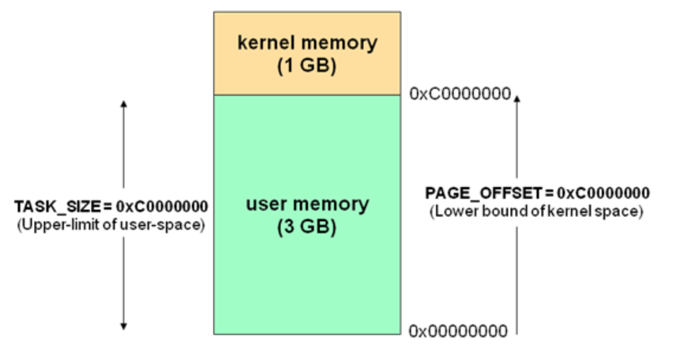
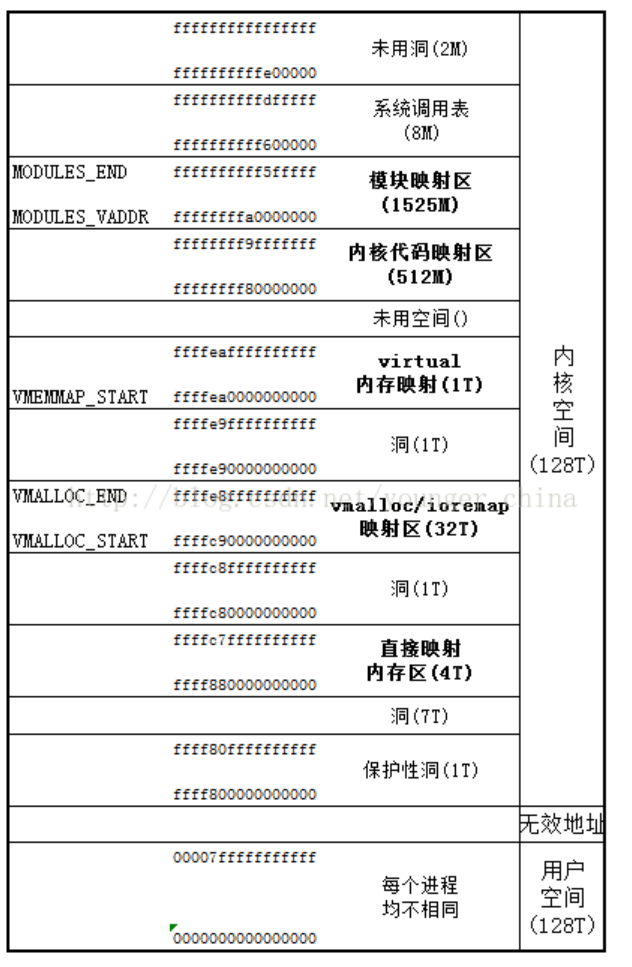
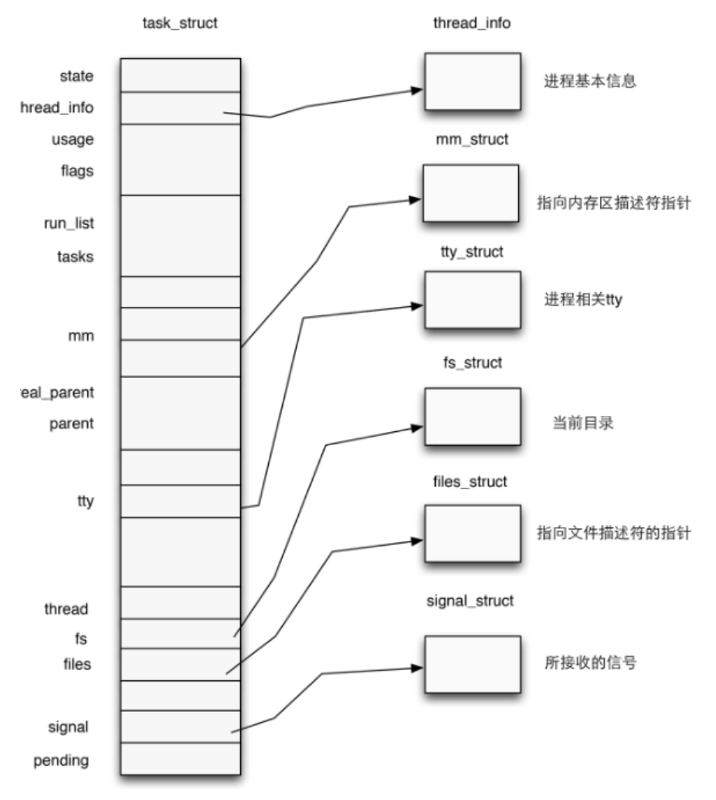

+++
date = '2025-07-07T17:50:57+08:00'
draft = true
title = 'Kernel'

+++

本节我们介绍在linux kernel pwn中所需要的基础知识

# basic knowledge

这里我们需要讲解一下对内核的一个基础知识点那么我们从一个操作系统开始

## operating system kernel

这里我们先开始分析操作系统的内核，大家学到这一步都应该知道我们的操作系统其实他也是一个软件，可以看作用户的普通应用程序与硬件之间的一个中间件，之中主要的作用就是用来调度系统的资源、控制io设备、操作网络与文件系统等，并为上层应用控制提供要给便利，抽象的接口。


这个就是操作系统的一个实际的抽象的概念，本质上与用户的进程一般无二，

## hierarchical protection domains

分级保护域又称为保护环，简称为rings，他是计算机不同资源划分不同权限的一个模型。

在一些硬件或者微代码级别上提供不同特权态模式的 CPU 架构上，保护环通常都是硬件强制的。Rings 是从最高特权级（通常被叫作 0 级）到最低特权级（通常对应最大的数字）排列的。

Intel 的 CPU 将权限分为四个等级：Ring0、Ring1、Ring2、Ring3，权限等级依次降低，现代操作系统模型中我们通常只会使用 ring0 和 ring3，对应操作系统内核与用户进程，即 CPU 在执行用户进程代码时处在 ring3 下。


现在我们使用的用户态和内核态这里主要有着两种

用户态：cpu运行在ring3+用户进程运行环境上下文

内核态：cpu运行在ring0+内核代码运行环境上下文

## 状态切换

cpu在不同的特权级别中切换主要有两种途径

1.中断与异常：当cpu收到一个中断/异常时，会切换到ring0，并根据中断描述表索引的中断处理代码以执行。

2.特权级相关指令：当cpu运行这些指令时会发生运行状态的一个改变，例如iret指令(ring0->ring3)或者syenter指令（ring3->ring0）

基于这些特权级别的切换的方式，现代操作系统的开发者包中包装了一个用于系统调用的一个指令（syscall），作为由用户态切换到内核态的入口，从而执行内核代码来完成用户的进程所需要的一些功能。当用户进程逍遥请求更高权限的服务时，便需要通过由系统提供的应用接口，使用系统调用以陷入内核态，再由操作系统完成请求。

### user space to kernel space （系统调用）

当发生系统调用，产生异常，外设产生中断等事件时，会发生用户态到内核态的一个切换，进入到内核相对应的处理程序总进行处理。

系统调用时内核御用户通信的直接接口，因此我们主要关注用户空间比较正常的系统调用这一行为，其对应的具体过程：

> 注意：当系统调用指令执行后，cpu便进入内核态，一下操作在内核态中完成

1.通过swapgs切换gs段的寄存器，将gs寄存器值和一个特定位置的值进行交换，目的是保存gs值，同时将该位置的值作为内核执行时的gs值使用

2.将当前栈顶（用户空间的栈顶）记录在cpu独占变量区域里，将cpu独占其余里记录的内核栈顶放入到rsp/esp中

3.通过push保存各寄存器值，具体的代码如下：

```asm
ENTRY(entry_SYSCALL_64)
 /* SWAPGS_UNSAFE_STACK是一个宏，x86直接定义为swapgs指令 */
 SWAPGS_UNSAFE_STACK

 /* 保存栈值，并设置内核栈 */
 movq %rsp, PER_CPU_VAR(rsp_scratch)
 movq PER_CPU_VAR(cpu_current_top_of_stack), %rsp


/* 通过push保存寄存器值，形成一个pt_regs结构 */
/* Construct struct pt_regs on stack */
pushq  $__USER_DS      /* pt_regs->ss */
pushq  PER_CPU_VAR(rsp_scratch)  /* pt_regs->sp */
pushq  %r11             /* pt_regs->flags */
pushq  $__USER_CS      /* pt_regs->cs */
pushq  %rcx             /* pt_regs->ip */
pushq  %rax             /* pt_regs->orig_ax */
pushq  %rdi             /* pt_regs->di */
pushq  %rsi             /* pt_regs->si */
pushq  %rdx             /* pt_regs->dx */
pushq  %rcx tuichu    /* pt_regs->cx */
pushq  $-ENOSYS        /* pt_regs->ax */
pushq  %r8              /* pt_regs->r8 */
pushq  %r9              /* pt_regs->r9 */
pushq  %r10             /* pt_regs->r10 */
pushq  %r11             /* pt_regs->r11 */
sub $(6*8), %rsp      /* pt_regs->bp, bx, r12-15 not saved */
```

4.通过汇编指令判断是否为x32_abi.

5.通过系统调用号，跳到全局变量sys_call_table相应位置继续执行系统的调用。

### kernel space to user space

退出时，流程

1.通过swapgs恢复gs值

2.通过sysretq或者iretq恢复带到用户控件中继续执行。如果医用iretq还需要给出用户空间的一些信息（CS, eflags/rflags, esp/rsp 等）。

## 虚拟内存空间

在现代操作系统中，计算机的虚拟内存地址空间通常被分为两块--供用户进程的用户空间（user space）与供操作系统内核使用的内核空间，对于linux而言，通常位于较高虚拟地址的虚拟内存空间被分配给内核使用，而位于较低虚拟地址空间这被分配给用户进程使用

32位下的虚拟内存空间布局如下：



64位下的虚拟内存空间布局如下：



### 进程权限管理

内核kernel调度一切的系统资源，并为用户应用程序提供运行环境，相应的，一个用程序的权限也都通过kernel进行一个管理的。

#### 进程描述符（process descriptor）

在内核中使用结构体task_struct表示一个进程，该结构体定义于内核源代码include/linux/sched.h中，

一个进程表述符的结构应当如下图表示



进程权限凭证（credential）

注意到task_struct的源代码中有着如下代码片段：

```c
/* Process credentials: */

/* Tracer's credentials at attach: */
// 附加时追踪器的一个凭证
const struct cred __rcu        *ptracer_cred;

/* Objective and real subjective task credentials (COW): */
//客观和真实主观任务凭证
const struct cred __rcu        *real_cred;
/* Effective (overridable) subjective task credentials (COW): */
//可以被更改的一个有效凭证 
const struct cred __rcu        *cred;
```

结构体 `cred` 用以管理一个进程的权限，该结构体定义于内核源码 `include/linux/cred.h` 中，如下：

```c
/*
 * The security context of a task
 *
 * The parts of the context break down into two categories:
 *
 *  (1) The objective context of a task.  These parts are used when some other
 *  task is attempting to affect this one.
 *
 *  (2) The subjective context.  These details are used when the task is acting
 *  upon another object, be that a file, a task, a key or whatever.
 *
 * Note that some members of this structure belong to both categories - the
 * LSM security pointer for instance.
 *
 * A task has two security pointers.  task->real_cred points to the objective
 * context that defines that task's actual details.  The objective part of this
 * context is used whenever that task is acted upon.
 *
 * task->cred points to the subjective context that defines the details of how
 * that task is going to act upon another object.  This may be overridden
 * temporarily to point to another security context, but normally points to the
 * same context as task->real_cred.
 */
struct cred {
    atomic_long_t   usage;
    kuid_t      uid;        /* real UID of the task */
    kgid_t      gid;        /* real GID of the task */
    kuid_t      suid;       /* saved UID of the task */
    kgid_t      sgid;       /* saved GID of the task */
    kuid_t      euid;       /* effective UID of the task */
    kgid_t      egid;       /* effective GID of the task */
    kuid_t      fsuid;      /* UID for VFS ops */
    kgid_t      fsgid;      /* GID for VFS ops */
    unsigned    securebits; /* SUID-less security management */
    kernel_cap_t    cap_inheritable; /* caps our children can inherit */
    kernel_cap_t    cap_permitted;  /* caps we're permitted */
    kernel_cap_t    cap_effective;  /* caps we can actually use */
    kernel_cap_t    cap_bset;   /* capability bounding set */
    kernel_cap_t    cap_ambient;    /* Ambient capability set */
#ifdef CONFIG_KEYS
    unsigned char   jit_keyring;    /* default keyring to attach requested
                     * keys to */
    struct key  *session_keyring; /* keyring inherited over fork */
    struct key  *process_keyring; /* keyring private to this process */
    struct key  *thread_keyring; /* keyring private to this thread */
    struct key  *request_key_auth; /* assumed request_key authority */
#endif
#ifdef CONFIG_SECURITY
    void        *security;  /* LSM security */
#endif
    struct user_struct *user;   /* real user ID subscription */
    struct user_namespace *user_ns; /* user_ns the caps and keyrings are relative to. */
    struct ucounts *ucounts;
    struct group_info *group_info;  /* supplementary groups for euid/fsgid */
    /* RCU deletion */
    union {
        int non_rcu;            /* Can we skip RCU deletion? */
        struct rcu_head rcu;        /* RCU deletion hook */
    };
} __randomize_layout;
```

一个 cred 结构体中记载了一个进程四种不同的用户 ID，在通常情况下这几个 ID 应当都是相同的：

- 真实用户 ID（real UID）：标识一个进程启动时的用户 ID
- 保存用户 ID（saved UID）：标识一个进程最初的有效用户 ID
- 有效用户 ID（effective UID）：标识一个进程正在运行时所属的用户 ID，一个进程在运行途中是可以改变自己所属用户的，因而权限机制也是通过有效用户 ID 进行认证的，内核通过 euid 来进行特权判断；为了防止用户一直使用高权限，当任务完成之后，euid 会与 suid 进行交换，恢复进程的有效权限
- 文件系统用户 ID（UID for VFS ops）：标识一个进程创建文件时进行标识的用户 ID

用户组 ID 同样分为四个：真实组 ID、保存组 ID、有效组 ID、文件系统组 ID，与用户 ID 是类似的，这里便不再赘叙。

### 进程权限改变 

前面我们讲到，一个进程的权限是由位于内核空间的 `cred` 结构体进行管理的，那么我们不难想到：只要改变一个进程的 `cred` 结构体，就能改变其执行权限。

在内核空间有如下两个函数，都位于 `kernel/cred.c` 中：

- `struct cred* prepare_kernel_cred(struct task_struct* daemon)`：该函数用以拷贝一个进程的 cred 结构体，并返回一个新的 cred 结构体，需要注意的是 daemon 参数应为有效的进程描述符地址。
- `int commit_creds(struct cred *new)`：该函数用以将一个新的 cred 结构体应用到进程。
